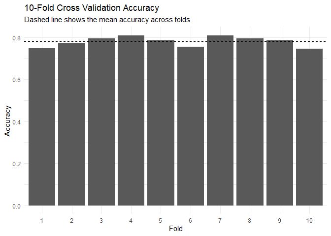
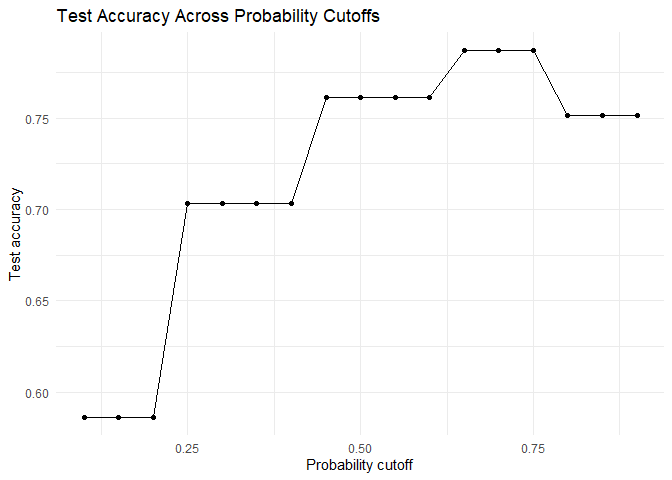

Lab 11 - Grading the professor, Pt. 2
================
Tsion

## Load packages and data

``` r
library(tidyverse) 
library(openintro)
library(titanic)
library(readxl)
```

``` r
# Load the Titanic 3 dataset
titanic3 <- read_excel(
  "data/titanic3.xls",
  col_types = c(
    "numeric", "numeric", "text", "text", "numeric", "numeric", "numeric",
    "text", "numeric", "text", "text", "text", "text", "text"
  )
)

# Load the training and test datasets from the titanic package
data("titanic_train")
data("titanic_test")
```

``` r
# Rename columns to lowercase to make them easier to work with
names(titanic3) <- names(titanic3) %>% tolower()
names(titanic_train) <- names(titanic_train) %>% tolower()
names(titanic_test) <- names(titanic_test) %>% tolower()

# Convert passenger class to an ordered factor
# 3 = third class, 2 = second class, 1 = first class
titanic3 <- titanic3 %>%
  mutate(pclass_ord = factor(pclass, ordered = TRUE, levels = c(3, 2, 1)))

titanic_train <- titanic_train %>%
  mutate(pclass_ord = factor(pclass, ordered = TRUE, levels = c(3, 2, 1)))

titanic_test <- titanic_test %>%
  mutate(pclass_ord = factor(pclass, ordered = TRUE, levels = c(3, 2, 1)))

# Look at the full Titanic dataset
glimpse(titanic3)
```

    ## Rows: 1,309
    ## Columns: 15
    ## $ pclass     <dbl> 1, 1, 1, 1, 1, 1, 1, 1, 1, 1, 1, 1, 1, 1, 1, 1, 1, 1, 1, 1,…
    ## $ survived   <dbl> 1, 1, 0, 0, 0, 1, 1, 0, 1, 0, 0, 1, 1, 1, 1, 0, 0, 1, 1, 0,…
    ## $ name       <chr> "Allen, Miss. Elisabeth Walton", "Allison, Master. Hudson T…
    ## $ sex        <chr> "female", "male", "female", "male", "female", "male", "fema…
    ## $ age        <dbl> 29.0000, 0.9167, 2.0000, 30.0000, 25.0000, 48.0000, 63.0000…
    ## $ sibsp      <dbl> 0, 1, 1, 1, 1, 0, 1, 0, 2, 0, 1, 1, 0, 0, 0, 0, 0, 0, 0, 0,…
    ## $ parch      <dbl> 0, 2, 2, 2, 2, 0, 0, 0, 0, 0, 0, 0, 0, 0, 0, 0, 1, 1, 0, 0,…
    ## $ ticket     <chr> "24160", "113781", "113781", "113781", "113781", "19952", "…
    ## $ fare       <dbl> 211.3375, 151.5500, 151.5500, 151.5500, 151.5500, 26.5500, …
    ## $ cabin      <chr> "B5", "C22 C26", "C22 C26", "C22 C26", "C22 C26", "E12", "D…
    ## $ embarked   <chr> "S", "S", "S", "S", "S", "S", "S", "S", "S", "C", "C", "C",…
    ## $ boat       <chr> "2", "11", NA, NA, NA, "3", "10", NA, "D", NA, NA, "4", "9"…
    ## $ body       <chr> NA, NA, NA, "135", NA, NA, NA, NA, NA, "22", "124", NA, NA,…
    ## $ home.dest  <chr> "St Louis, MO", "Montreal, PQ / Chesterville, ON", "Montrea…
    ## $ pclass_ord <ord> 1, 1, 1, 1, 1, 1, 1, 1, 1, 1, 1, 1, 1, 1, 1, 1, 1, 1, 1, 1,…

``` r
summary(titanic3)
```

    ##      pclass         survived         name               sex           
    ##  Min.   :1.000   Min.   :0.000   Length:1309        Length:1309       
    ##  1st Qu.:2.000   1st Qu.:0.000   Class :character   Class :character  
    ##  Median :3.000   Median :0.000   Mode  :character   Mode  :character  
    ##  Mean   :2.295   Mean   :0.382                                        
    ##  3rd Qu.:3.000   3rd Qu.:1.000                                        
    ##  Max.   :3.000   Max.   :1.000                                        
    ##                                                                       
    ##       age              sibsp            parch          ticket         
    ##  Min.   : 0.1667   Min.   :0.0000   Min.   :0.000   Length:1309       
    ##  1st Qu.:21.0000   1st Qu.:0.0000   1st Qu.:0.000   Class :character  
    ##  Median :28.0000   Median :0.0000   Median :0.000   Mode  :character  
    ##  Mean   :29.8811   Mean   :0.4989   Mean   :0.385                     
    ##  3rd Qu.:39.0000   3rd Qu.:1.0000   3rd Qu.:0.000                     
    ##  Max.   :80.0000   Max.   :8.0000   Max.   :9.000                     
    ##  NA's   :263                                                          
    ##       fare            cabin             embarked             boat          
    ##  Min.   :  0.000   Length:1309        Length:1309        Length:1309       
    ##  1st Qu.:  7.896   Class :character   Class :character   Class :character  
    ##  Median : 14.454   Mode  :character   Mode  :character   Mode  :character  
    ##  Mean   : 33.295                                                           
    ##  3rd Qu.: 31.275                                                           
    ##  Max.   :512.329                                                           
    ##  NA's   :1                                                                 
    ##      body            home.dest         pclass_ord
    ##  Length:1309        Length:1309        3:709     
    ##  Class :character   Class :character   2:277     
    ##  Mode  :character   Mode  :character   1:323     
    ##                                                  
    ##                                                  
    ##                                                  
    ## 

I can see that the full `titanic3` dataset has 1,309 passengers. There
are also missing values in some variables, especially variables like
`body`, which makes sense because not every body was recovered after the
sinking.

### Part 1: Apparent accuracy

## Exercise 1

``` r
# Fit a logistic regression model predicting survival from sex and passenger class
m_apparent <- glm(
  survived ~ sex + pclass,
  data = titanic3,
  family = binomial
)

# View model output
summary(m_apparent)
```

    ## 
    ## Call:
    ## glm(formula = survived ~ sex + pclass, family = binomial, data = titanic3)
    ## 
    ## Coefficients:
    ##             Estimate Std. Error z value Pr(>|z|)    
    ## (Intercept)  2.96331    0.23511   12.60   <2e-16 ***
    ## sexmale     -2.51496    0.14671  -17.14   <2e-16 ***
    ## pclass      -0.86027    0.08502  -10.12   <2e-16 ***
    ## ---
    ## Signif. codes:  0 '***' 0.001 '**' 0.01 '*' 0.05 '.' 0.1 ' ' 1
    ## 
    ## (Dispersion parameter for binomial family taken to be 1)
    ## 
    ##     Null deviance: 1741.0  on 1308  degrees of freedom
    ## Residual deviance: 1257.2  on 1306  degrees of freedom
    ## AIC: 1263.2
    ## 
    ## Number of Fisher Scoring iterations: 4

### 1.2

``` r
# Generate predicted survival probabilities for each passenger
p_apparent <- predict(m_apparent, type = "response")

# Look at the first few predicted probabilities
head(p_apparent)
```

    ##         1         2         3         4         5         6 
    ## 0.8911983 0.3984507 0.8911983 0.3984507 0.8911983 0.3984507

### 1.3

I used 0.5 as the cutoff of predicting survival and non-survival

``` r
# Convert probabilities into predicted classes
# If probability is greater than 0.5, predict survived
# Otherwise, predict did not survive
yhat_apparent <- ifelse(p_apparent > 0.5, 1, 0)

# Look at the first few predicted classes
head(yhat_apparent)
```

    ## 1 2 3 4 5 6 
    ## 1 0 1 0 1 0

### 1.4

``` r
# Calculate apparent accuracy
acc_apparent <- mean(yhat_apparent == titanic3$survived, na.rm = TRUE)

acc_apparent
```

    ## [1] 0.7799847

### 1.5

Apparent accuracy is likely to overestimate true predictive performance
because the model is being tested on the same data it was trained on.

In my opinion, this is like studying the answer key and then taking the
same test. The model may look good because it already had access to the
full dataset.

Another analogy I can think of is is practicing a speech in front of a
mirror and then judging your public speaking ability only from that
mirror practice. It tells you something, but it does not really show how
well you would perform in a new situation.

### Part 2: Holding passengers back

## Exercise 2

## 2.1

``` r
# Fit the same logistic regression model, but only using the training data
m_split <- glm(
  survived ~ sex + pclass,
  data = titanic_train,
  family = binomial
)

# View the model output
summary(m_split)
```

    ## 
    ## Call:
    ## glm(formula = survived ~ sex + pclass, family = binomial, data = titanic_train)
    ## 
    ## Coefficients:
    ##             Estimate Std. Error z value Pr(>|z|)    
    ## (Intercept)   3.2946     0.2974  11.077   <2e-16 ***
    ## sexmale      -2.6434     0.1838 -14.380   <2e-16 ***
    ## pclass       -0.9606     0.1061  -9.057   <2e-16 ***
    ## ---
    ## Signif. codes:  0 '***' 0.001 '**' 0.01 '*' 0.05 '.' 0.1 ' ' 1
    ## 
    ## (Dispersion parameter for binomial family taken to be 1)
    ## 
    ##     Null deviance: 1186.7  on 890  degrees of freedom
    ## Residual deviance:  827.2  on 888  degrees of freedom
    ## AIC: 833.2
    ## 
    ## Number of Fisher Scoring iterations: 4

### 2.2

``` r
# Generate predicted probabilities for the training data
p_train <- predict(m_split, type = "response")

# Convert probabilities to predicted survival decisions using 0.5 as the cutoff
yhat_train <- ifelse(p_train > 0.5, 1, 0)

# Calculate training accuracy
acc_train <- mean(yhat_train == titanic_train$survived, na.rm = TRUE)

acc_train
```

    ## [1] 0.7867565

### 2.3

``` r
# The Titanic test data does not include survived, so we join it from titanic3
# We use name and ticket to match passengers between the datasets
titanic_test_survival <- titanic_test %>%
  left_join(
    titanic3 %>% select(name, ticket, survived),
    by = c("name", "ticket")
  )

# Generate predicted probabilities for the test data
p_test <- predict(m_split, newdata = titanic_test_survival, type = "response")

# Convert probabilities to predicted survival decisions
yhat_test <- ifelse(p_test > 0.5, 1, 0)

# Calculate test accuracy
acc_test <- mean(yhat_test == titanic_test_survival$survived, na.rm = TRUE)

acc_test
```

    ## [1] 0.7614213

Ok looks good!

### 2.4

The training accuracy is larger than the test accuracy. The training
accuracy is about 0.787, while the test accuracy is about 0.761. This is
the typical pattern because the model was fit using the training data,
so it usually performs a little better on data it has already seen. The
test data is more difficult because those passengers were held back and
were not used to build the model.

For Lloyd’s, the test accuracy is closer to what they actually need.
Lloyd’s would not just want to know how well the model explains past
Titanic passengers. They would want to know how well the model predicts
future or unseen passengers. In my opinion, test accuracy is more
realistic because it measures performance on new data.

If `acc_test` happened to be higher than `acc_train`, that would not
invalidate holdout testing. It could happen by chance if the test set
was slightly easier to predict than the training set. The point of
holdout testing is not that test accuracy must always be lower, but that
it gives a more honest estimate because the test data was not used to
train the model.

``` r
# Compare training accuracy and test accuracy
accuracy_comparison <- tibble(
  data = c("Training data", "Test data"),
  accuracy = c(acc_train, acc_test)
)

accuracy_comparison
```

    ## # A tibble: 2 × 2
    ##   data          accuracy
    ##   <chr>            <dbl>
    ## 1 Training data    0.787
    ## 2 Test data        0.761

### Exercise 3: Cross validation across timelines

### 3.1

This creates 10 folds. Each passenger is assigned to one fold, and each
fold will take a turn being the test set.

``` r
# Create a cross-validation datset
# Keep only the variables needed for this model
# Then randomly assign pasengers to 10 folds
set.seed(471)

titanic_cv <- titanic3 %>%
  filter(!is.na(survived), !is.na(sex), !is.na(pclass)) %>%
  mutate(
    fold = sample(rep(1:10, length.out = n()))
  )

# Check the folds
titanic_cv %>%
  count(fold)
```

    ## # A tibble: 10 × 2
    ##     fold     n
    ##    <int> <int>
    ##  1     1   131
    ##  2     2   131
    ##  3     3   131
    ##  4     4   131
    ##  5     5   131
    ##  6     6   131
    ##  7     7   131
    ##  8     8   131
    ##  9     9   131
    ## 10    10   130

### 3.2

``` r
# Create an empty results data frame
cv_results <- data.frame(
  fold = sort(unique(titanic_cv$fold)),
  accuracy = NA_real_
)

# Loop through each fold
for (j in cv_results$fold) {
  
  # Use all folds exept j as training data
  train_j <- titanic_cv %>%
    filter(fold != j)
  
  # Use fold j as test data
  test_j <- titanic_cv %>%
    filter(fold == j)
  
  # Fit the model on the trainng folds
  m_j <- glm(
    survived ~ sex + pclass,
    data = train_j,
    family = binomial
  )
  
  # Predict survival probablities for the test fold
  p_j <- predict(m_j, newdata = test_j, type = "response")
  
  # Convert probabilities into class predictions using 0.5 cutoff
  yhat_j <- ifelse(p_j > 0.5, 1, 0)
  
  # Compute accuracy for this fold
  cv_results$accuracy[cv_results$fold == j] <- mean(
    yhat_j == test_j$survived,
    na.rm = TRUE
  )
}

# View fold accuracies
cv_results
```

    ##    fold  accuracy
    ## 1     1 0.7480916
    ## 2     2 0.7709924
    ## 3     3 0.7938931
    ## 4     4 0.8091603
    ## 5     5 0.7862595
    ## 6     6 0.7557252
    ## 7     7 0.8091603
    ## 8     8 0.7938931
    ## 9     9 0.7862595
    ## 10   10 0.7461538

### 3.3

``` r
# Summarize cross-validation accuracy
cv_summary <- cv_results %>%
  summarize(
    cv_mean = mean(accuracy),
    cv_sd = sd(accuracy),
    cv_min = min(accuracy),
    cv_max = max(accuracy)
  )

cv_summary
```

    ##     cv_mean      cv_sd    cv_min    cv_max
    ## 1 0.7799589 0.02356821 0.7461538 0.8091603

### 3.4

``` r
# Plot accuracy for each fold
ggplot(cv_results, aes(x = factor(fold), y = accuracy)) +
  geom_col() +
  geom_hline(
    yintercept = mean(cv_results$accuracy),
    linetype = "dashed"
  ) +
  labs(
    title = "10-Fold Cross Validation Accuracy",
    subtitle = "Dashed line shows the mean accuracy across folds",
    x = "Fold",
    y = "Accuracy"
  ) +
  theme_minimal()
```

<!-- -->

### 3.5

The cross-validation mean is usually lower than the apparent accuracy
because cross validation tests the model on passengers that were held
out from training. I think this makes it a more honest estimate than
apparent acuracy.

The cross-validation standard deviation tells us how stable the model is
across different folds. A small standard deviation means the model
performs similarly across folds. A larger standard deviation would mean
performance depends more on which passengers happen to be in the test
fold.

If Lloyd’s asked for a single performance estimate, I would report the
cross-validation mean rather than the one-time test accuracy. The test
accuracy is based on just one split, while cross validation averages
across multiple splits. I think that makes the cross-validation mean
more stable and reliable.

### Exercise 4: When the cutoff is a policy decision

### 4.1

``` r
# Try three possible cutoffs
cutoffs <- c(0.3, 0.5, 0.7)

# Create an empty results data frame
cutoff_results <- data.frame(
  cutoff = cutoffs,
  accuracy = NA_real_
)

# Calculate test accuracy for each cutoff
for (i in seq_along(cutoffs)) {
  
  c0 <- cutoffs[i]
  
  # Predict survival if probability is greater than the cutoff
  yhat_c <- ifelse(p_test > c0, 1, 0)
  
  # Store accuracy
  cutoff_results$accuracy[i] <- mean(
    yhat_c == titanic_test_survival$survived,
    na.rm = TRUE
  )
}

cutoff_results
```

    ##   cutoff  accuracy
    ## 1    0.3 0.7030457
    ## 2    0.5 0.7614213
    ## 3    0.7 0.7868020

### 4.2

``` r
# Try a wider range of cutoffs
cutoffs_fine <- seq(0.1, 0.9, by = 0.05)

# Create an empty results data frame
cutoff_results_fine <- data.frame(
  cutoff = cutoffs_fine,
  accuracy = NA_real_
)

# Calculate accuracy for each cutoff
for (i in seq_along(cutoffs_fine)) {
  
  c0 <- cutoffs_fine[i]
  
  # Convert probabilities into predicted classes using this cutoff
  yhat_c <- ifelse(p_test > c0, 1, 0)
  
  # Store accuracy
  cutoff_results_fine$accuracy[i] <- mean(
    yhat_c == titanic_test_survival$survived,
    na.rm = TRUE
  )
}

# Plot accuracy across cutoffs
ggplot(cutoff_results_fine, aes(x = cutoff, y = accuracy)) +
  geom_line() +
  geom_point() +
  labs(
    title = "Test Accuracy Across Probability Cutoffs",
    x = "Probability cutoff",
    y = "Test accuracy"
  ) +
  theme_minimal()
```

<!-- -->

### 4.3

The cutoff that maximized accuracy was **0.65**, with an accuracy of
about **0.787**.

Accuracy might be a poor criterion for selecting a cutoff in
underwriting because not all mistakes have the same cost. A false
positive would mean predicting that a passenger survives when they
actually do not survive.

- For Lloyd’s, this could be very expensive if the company offers a
  cheaper policy to someone who actually dies. A false negative would
  mean predicting that a passenger does not survive when they actually
  does survive. That mistake also matters, but it may have a different
  financial consequence.

In my opinion, Lloyd’s should not choose the cutoff based only on
accuracy. I would want to use an **expected cost** metric, where false
positives and false negatives can be given different costs. Sensitivity
and specificity would also be useful because they show whether the model
is better at identifying survivors or non-survivors.

``` r
# Find the cutoff with the highest accuracy
cutoff_results_fine %>%
  arrange(desc(accuracy)) %>%
  slice(1)
```

    ##   cutoff accuracy
    ## 1   0.65 0.786802
